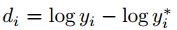

# Depth Map Prediction from a Single Image using a Multi-Scale Deep Network
```
Author 
	David Eigen	Christian Puhrsch	Rob Fergus
From
	Dept. of Computer Science, Courant Institute, New York University
```

## Motivation
- Get Depth Map from Monocular Camera using Convolution Neural Network. 


----------

## Approach


 - Global Coarse-Scale Network
	
	- Usage: 
		- predict the overall depth map structure using a global view of the scene
	- Note
		- The upper layer of this network are fully connected, and thus contain the entire image field of view.  In so doing, the network is able to integrate a global understanding of the full scene to predict the depth. Such an understanding is needed in the single-image case to make effective use of cues such as vanishing points, object locations, and room alignment.	
		- All hidden layers use Relu, with the exception of the coarse output layer7, which is linear.

 - Local Fine-Scale network
	
	- Usage: 
		- Edit the Coarse prediction it receives to align with local details such as object and wall edges.
	- Note
		- The coarse output is fed in as an additional low-level feature map. 
		- All hidden units use rectified linear activations except the last convolutional layer which is linear, as it predicts
the target depth.


 - Scale-Invariant Error 
	- 
	- 
	- Usage : 
		- Use a scale-invariant error to measure the relationships between points in the scene. 
	- Note :
		- **y** is predict depth map, and **y*** is ground truth depth map.
		- In equation (2),  to have low error, each pair of pixels in the prediction must differ in depth by an amount similar to that of the corresponding pair in the ground truth.
		- Equation (3) relates the metric to the original l2 error, but
with an additional term, , that credits mistakes if they are in the same direction and penalizes them if they oppose.


 - Training Loss
	- 
	- Note : 
		-  Setting λ = 0 reduces to elementwise l2, while λ = 1 is the
scale-invariant error exactly
		- We use the average of these, λ = 0.5


----------


##Experiments
	
- Data Set 
	- NYU Dataset
	- KITTI
- Baseline
	- Make 3D
- Measurement
	- 


----------


##Result
- NYU Depth
	- 
- KITTI
	- 

